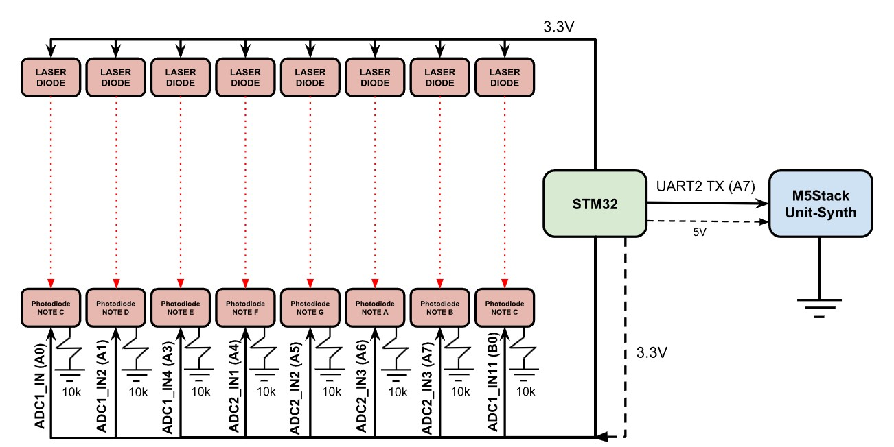
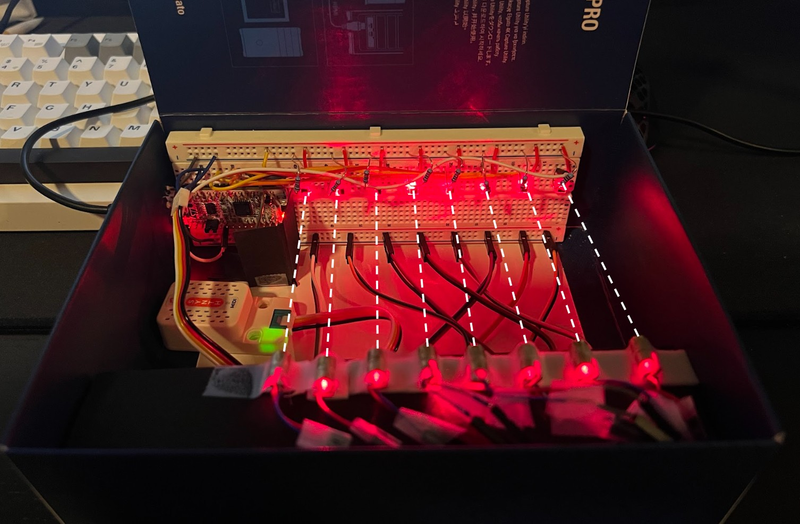
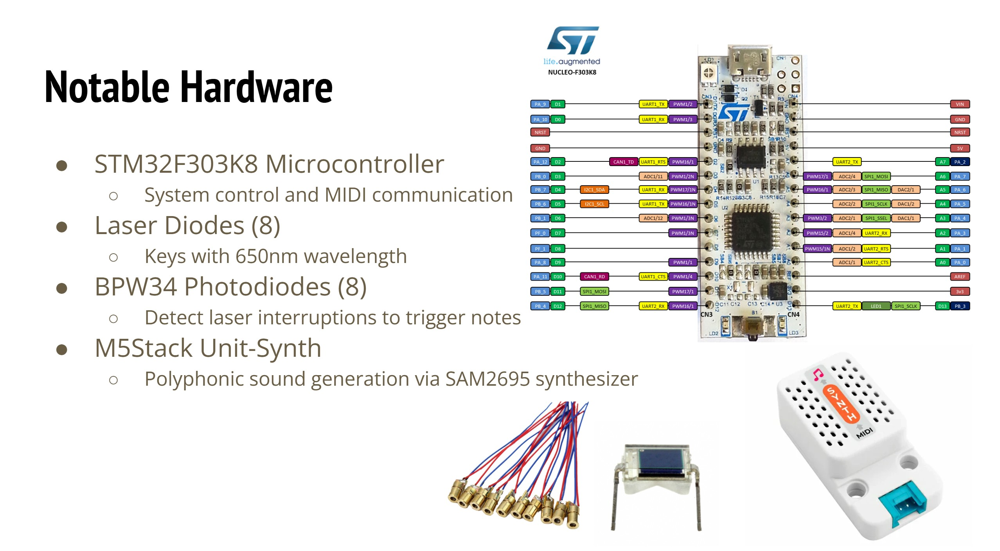
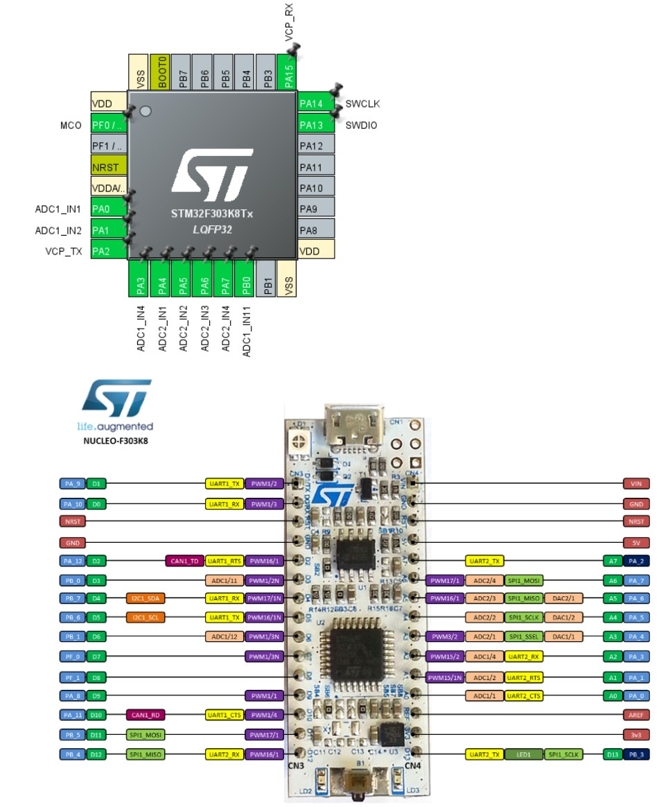

# STM32 Laser Synth Piano

An embedded systems project using the STM32F303K8 microcontroller to create a laser-based MIDI synthesizer.  
This project integrates UART, ADC, and MIDI signal generation to simulate piano keys triggered by laser beam interruptions.

## Project Overview

The Laser Synth Piano uses eight laser diodes and photodiodes to detect finger interruptions, acting as virtual piano keys.  
When the user “breaks” the laser beam (simulating a non-physical key tap), a musical note is generated. The project
incorporates an M5Stack Unit-Synth polyphonic synthesizer component with built-in digital
communication (UART). The unit-synth features a built-in SAM2695 synthesizer and NS4150B Class D amplifier, (useful for polyphony).

## Hardware Used

- Microcontroller: STM32F303K8 Nucleo board
- Output Synth Module: M5Stack Unit-Synth
- Inputs: 8 laser diodes and 8 photodiodes
- Communication: UART MIDI protocol at 31250 baud
- Tools: STM32CubeIDE

## System Block Diagram

## Hardware Setup

## Notable Hardware Components

## STM32 Pin Configuration

## How It Works

- Laser interruption detection: 
  Light from the laser creates a small electrical current when hitting the photodiode. Each photodiode's analog voltage is read through the ADC.
  
- Hysteresis implementation:
  Upper and lower thresholds are set to avoid false detections due to noise.

- MIDI Note transmission:  
  When a beam interruption is detected, a MIDI note-on message is sent over UART. When the beam is restored, a MIDI note-off message is sent.

- Channel mapping:  
  Each laser/diode pair is mapped to a distinct musical note according to standard MIDI note values.

## Key Features

- Stable ADC Reading: 
  Averaged ADC sampling to reduce flicker and false triggers.

- Dynamic Note Handling:  
  Notes are sent as discrete UART packets to ensure proper note on/off timing.

- Real-Time Performance:
  Designed for minimal latency in detection and transmission.

- Modular Design:  
  Code is modularized for easy expansion (e.g., adding more lasers or remapping notes).

## Development Notes

- STM32CubeIDE was used for project setup, clock configuration, and initial peripheral generation.
- Custom ADC functions (`read_adc_stable`, `select_adc_channel`) were written for more stable analog readings.
- UART transmission was manually controlled for MIDI message formation (`send_midi_message`).

## (NOTE) Running the Project

- Load the provided `main.c` into a STM32CubeIDE project configured for the STM32F303K8.
- Connect laser diodes and photodiodes according to the provided pinout.
- Connect UART TX to an external MIDI synth (e.g., M5Stack Unit Synth).
- Build and flash the project to the Nucleo board.
- Verify functionality of single/multiple notes.

## Acknowledgment

Developed for Embedded Systems course.
California State University, Sacramento — Fall 2024.

